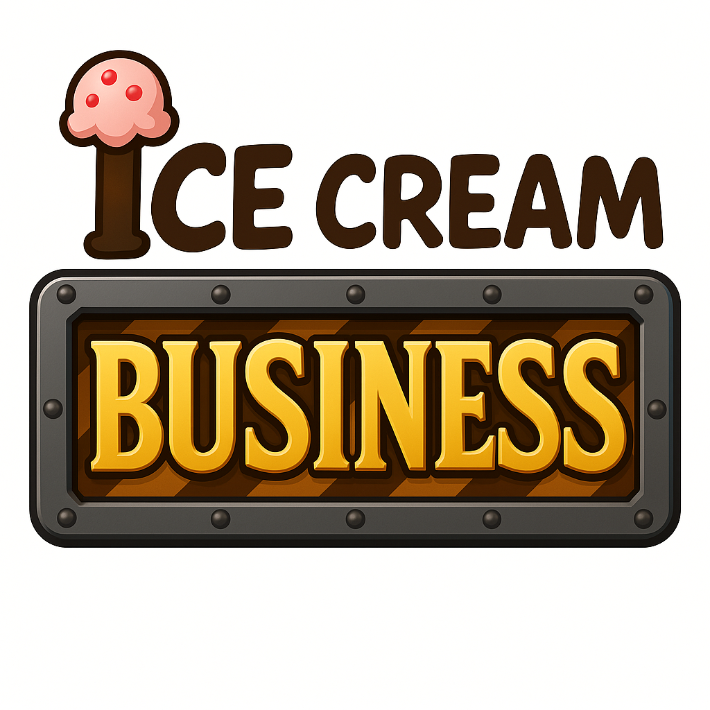

# IceCreamBusiness
3D игра в жанре симулятора, где игрок играет за продавца мороженного в своем ларьке и каждый день выполняет заказы приходящих к нему клиентов.

## Статус
**Текущая версия: Релиз**
- Реализовано:
  - Движение игрока
  - Базовая механика игрового времени
  - Система заказов
  - Экономика и баланс
  - Настройки управления
  - Настройки общие
  - Система переводов игры
  - Окружение
  - Аудио, текстуры, модели

## Требования
- UnityEngine 2021.3.29f1 LTS
- Blender 3.6+ (необязательно)

## Установка
Релиз: https://github.com/F12Enter/IceCreamBusiness/releases

Или исходный код:

1. `git clone https://github.com/F12Enter/IceCreamBusiness.git`
2. Открыть проект в Unity Hub.
